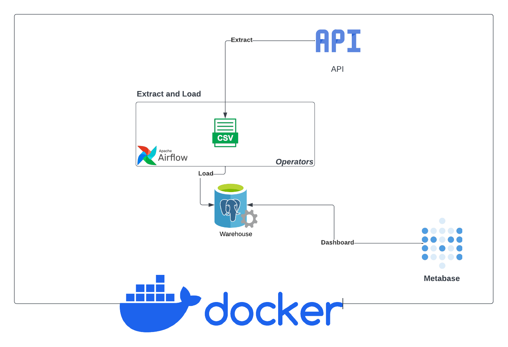
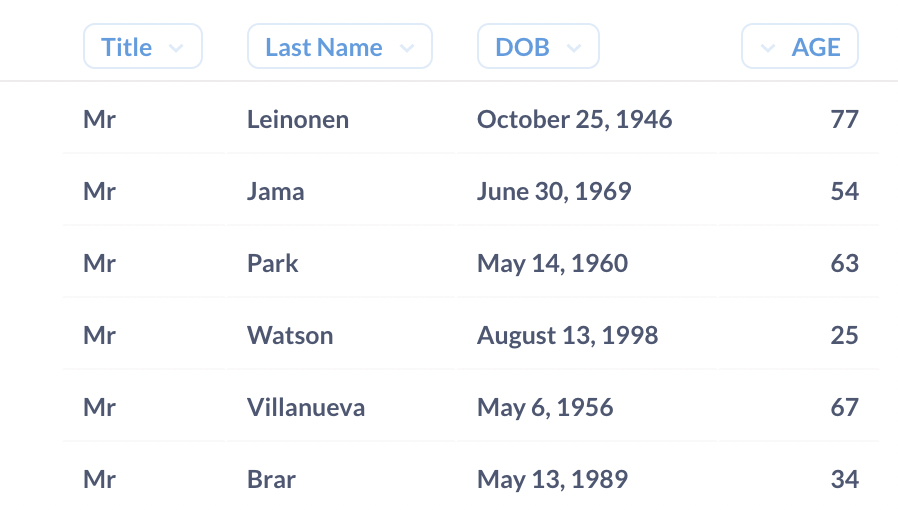
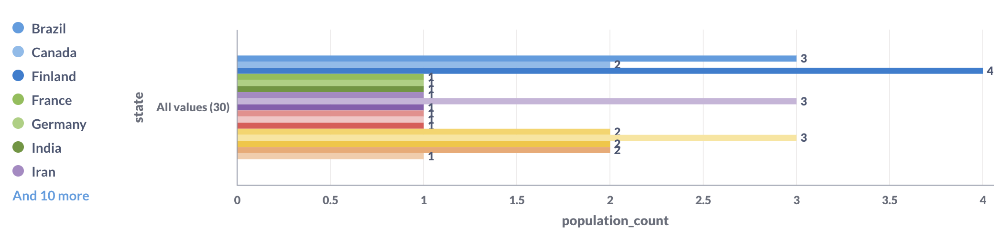
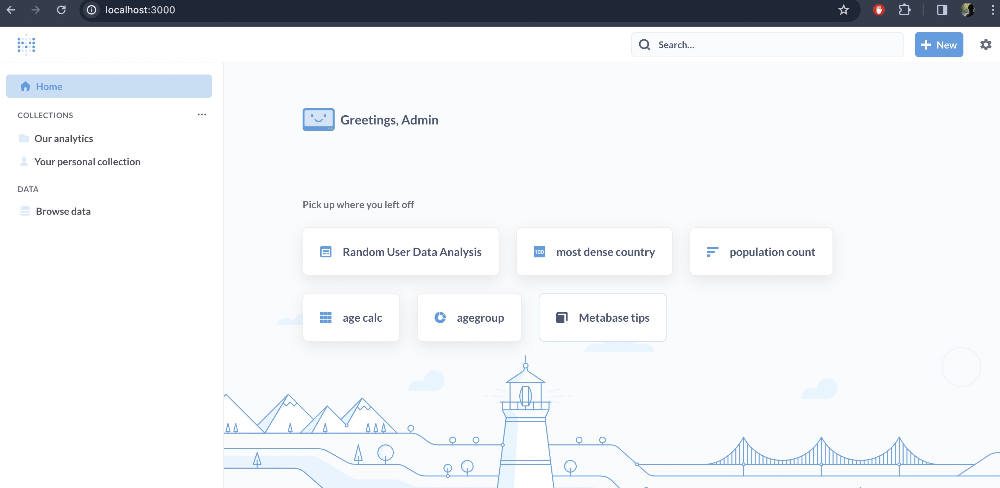
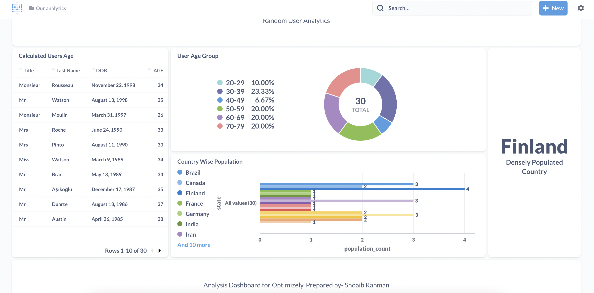

# Prerequisite

> Make sure docker desktop is installed in your local machine. You can find how to install desktop here: 

1. Windows: https://docs.docker.com/desktop/install/windows-install/
2. Mac: https://docs.docker.com/desktop/install/mac-install/
3. Linux: https://docs.docker.com/desktop/install/linux-install/

> You can still solve the problem, without using the docker. Only you won't be able to test it. Good luck!

# Pipeline

<center>

</center>

System design of our ELT pipelie. Part of the assignment is to understand the diagram and implement it step by step. Necessary comments are provided inside the code file to help you. Please read the doc and follow the steps.

### How to run the code
Run the local environment by going into the root directory and execute:
```shell
docker compose up -d
```

After Airflow webserver is running, open Airflow in your local browser and go to:
```
localhost:8080
```
with username: `airflow`
and password: `airflow`

After pgadmin is running, open your local browser and go to:
```
localhost:4000
```
with email: `admin@pg.com`
and password: `admin`

After Metabase is running, open Metabase in your local browser and go to:
```
localhost:3000
```
then create a user login account and connect to the data warehouse 
with username: `admin`
and password: `admin`
and database: `warehouse`
and host: `warehouse`
and port: `5432`

> You don't need to change any config to run the project

> You don't need to install any aditional packages

> You are free to use any built-in python packages

> Make sure you git initilize the repo and commit your changes properly.

# Questionnaire

## Software Engineer Focused

### Problem Statement
Fetch random user data with the provided api. 

#### Context
- Here is sample of the api reference.
```json
{
  "results": [
    {
      "gender": "female",
      "name": {
        "title": "Miss",
        "first": "Jennie",
        "last": "Nichols"
      },
      "location": {
        "street": {
          "number": 8929,
          "name": "Valwood Pkwy",
        },
        "city": "Billings",
        "state": "Michigan",
        "country": "United States",
        "postcode": "63104",
        "coordinates": {
          "latitude": "-69.8246",
          "longitude": "134.8719"
        },
        "timezone": {
          "offset": "+9:30",
          "description": "Adelaide, Darwin"
        }
      },
      "email": "jennie.nichols@example.com",
      "login": {
        "uuid": "7a0eed16-9430-4d68-901f-c0d4c1c3bf00",
        "username": "yellowpeacock117",
        "password": "addison",
        "salt": "sld1yGtd",
        "md5": "ab54ac4c0be9480ae8fa5e9e2a5196a3",
        "sha1": "edcf2ce613cbdea349133c52dc2f3b83168dc51b",
        "sha256": "48df5229235ada28389b91e60a935e4f9b73eb4bdb855ef9258a1751f10bdc5d"
      },
      "dob": {
        "date": "1992-03-08T15:13:16.688Z",
        "age": 30
      },
      "registered": {
        "date": "2007-07-09T05:51:59.390Z",
        "age": 14
      },
      "phone": "(272) 790-0888",
      "cell": "(489) 330-2385",
      "id": {
        "name": "SSN",
        "value": "405-88-3636"
      },
      "picture": {
        "large": "https://randomuser.me/api/portraits/men/75.jpg",
        "medium": "https://randomuser.me/api/portraits/med/men/75.jpg",
        "thumbnail": "https://randomuser.me/api/portraits/thumb/men/75.jpg"
      },
      "nat": "US"
    }
  ]
}
```
- The response contains user data such as name, age, nationality, picture and some other info.

#### Tasks
1. Implement the provided functions in `extract.py` file, which should make a api call using multiprocessing or multithreading  and write all the reposponse in a flat csv file.
2. Implement the provided functions in `migration.py` file, which makes sure
that csv file and directory and database schema and table existing before we 
write and load data in them.
3. Implement the provided functions in `load.py`, which reads the flat csv file and bluk load its data in the data warehouse using appropriate data base connection string.
4. Implement the provided functions in `model.py`, which setups the db connection and also defines python users object model. 
5. Do not change the `config.py` file.
6. Do not change the provided functions, you can add your own functions and call them from the provided functions. 

## Database Focused

### Problem Statement
Initilize necessary sql schemas and tables for our data warehouse. 

#### Context
- When we start warehouse docker container, we like to init with proper schemas and tables with our raw data. 

#### Tasks
Define schemas and tables in root `scripts` folder by following the steps:

1. Create a schema named `raw`. You should drop the schema if it already exist.
2. Create a table called `users` under `raw` schema with columns
  > 1. gender
  > 2. name
  > 3. first
  > 4. second
  > 5. date of birth
3. Create a table called `locations` under `raw` schema wuth columns.
  > 1. city
  > 2. state
  > 3. country
  > 4. postcode
  > 5. country code (nat)
4. Create a table called `additional` under `raw` schema with columns.
  > 1. phone
  > 2. email
  > 3. picture_large
5. Do not forget add necessary primary and foreign key in each table

The table should have all the column you got from the api response. You deside the type of each column (but should be appropiate based on the value you recived in the api response). It should have a id column using UUID as primary key and not null. You should drop the table if it already exist.


## Data Engineering Focused

### Problem Statement
Create a [Airflow](https://airflow.apache.org/) pipeline which runs once a daily. 

#### Context
- Our random user api return user object. We would like to fetch a set of random user data daily and load it our data warehouse.


#### Tasks
Create a Data pipeline (DAG) in Python with following steps:

1. Airflow dag should be configured as follows:
 > 1. retries: 3
 > 2. retry delay: 3
 > 3. schedule interval: daily
 > 4. start date: you decide
2. So far the python scripts that you have written in previous steps by utilizing them implement your airflow dag.
3. Create a dag using three `bashoperator`` in `elt_pipeline.py`
4. All the task in the dag should be run using `bashoperator`.

## Data Analytics Focused

### Problem Statement
Create some basic analytics by querying the tables in `raw` schema. 

#### Context
- In the previous task you inserted the raw `users` data into appropiate tables. Now we would like to get some results by querying the model.


#### Tasks

1. Calculate age of each person utill current data from dob. 
  >write you sql query here
### Solution:
  > QUERY:
  SELECT usr.name "Title", usr.last as "Last Name", date_of_birth "DOB", 
       EXTRACT(YEAR FROM AGE(date_of_birth)) AS "AGE"
  FROM raw.users usr;

 RESULT:


2. Count population based on country and then show how many in each state.
  >write you sql query here:
  ### Solution:
  >Query:
  SELECT country, state, COUNT(1) AS population_count
FROM raw.locations
GROUP BY 1, 2
ORDER BY 1,2;

RESULT:

3. Find out densely populated country
  >write you sql query here
  ### Solution:
>QUERY:
  RESULT:
  SELECT country, COUNT(1) AS population_count
FROM raw.locations
GROUP BY country
ORDER BY population_count DESC
LIMIT 1;

RESULT:


4. What is the population count by age group in the increment of 10 upto 100?
  >write you sql query here
  ### Solution:
>QUERY:
  WITH age_data as ( 
SELECT EXTRACT(YEAR FROM AGE(date_of_birth)) AS age
  FROM raw.users)
SELECT
  CASE
    WHEN age BETWEEN 0 AND 9 THEN '0-9'
    WHEN age BETWEEN 10 AND 19 THEN '10-19'
    WHEN age BETWEEN 20 AND 29 THEN '20-29'
    WHEN age BETWEEN 30 AND 39 THEN '30-39'
    WHEN age BETWEEN 40 AND 49 THEN '40-49'
    WHEN age BETWEEN 50 AND 59 THEN '50-59'
    WHEN age BETWEEN 60 AND 69 THEN '60-69'
    WHEN age BETWEEN 70 AND 79 THEN '70-79'
    WHEN age BETWEEN 80 AND 89 THEN '80-89'
    WHEN age BETWEEN 90 AND 99 THEN '90-99'
    ELSE '100+'
  END AS "Age Group",
  COUNT(*) AS "Population Count"
from age_data
GROUP BY 1
ORDER BY 1;

RESULT:


5. Chalenge here is to write your query in `metabase` software. Don't worry if you don't know how use `metabase` (you can skip this step). Post your metabase graph screenshot here.
>
# Dashboard:

# References

1. https://airflow.apache.org/docs/apache-airflow/stable/howto/operator/bash.html
2. https://www.youtube.com/watch?v=CLkzXrjrFKg&ab_channel=coder2j
3. https://cloud.google.com/composer/docs/how-to/using/writing-dags
4. https://godatadriven.com/blog/apache-airflow-tutorial-for-data-pipelines/
